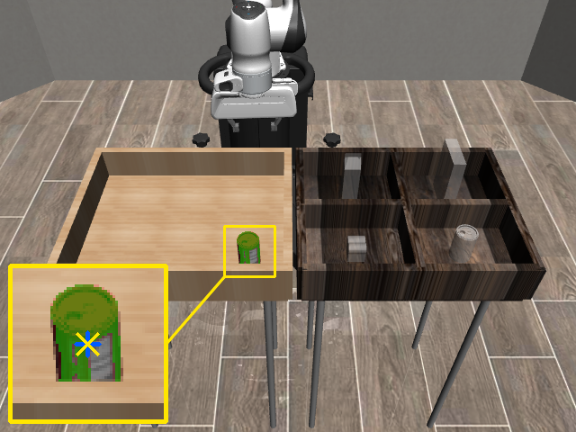
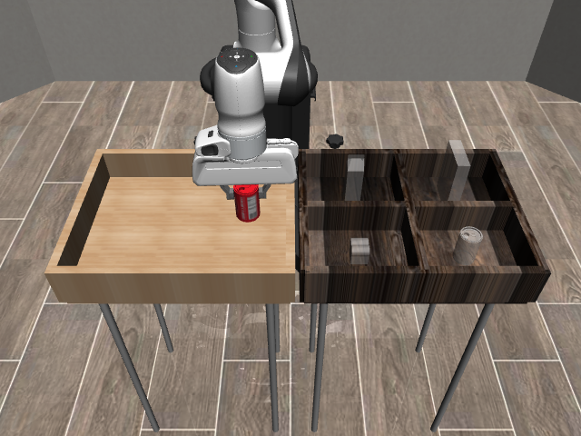
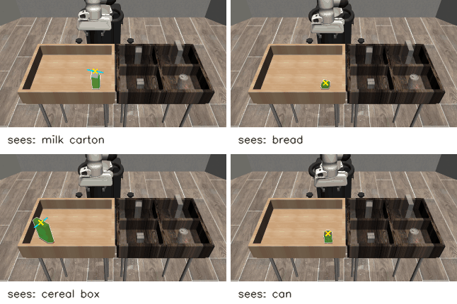
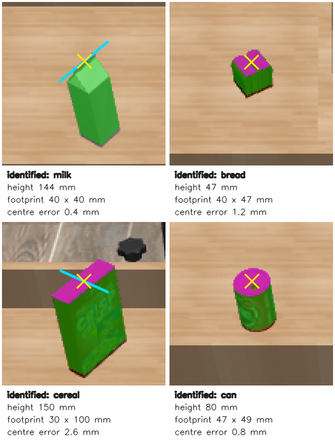
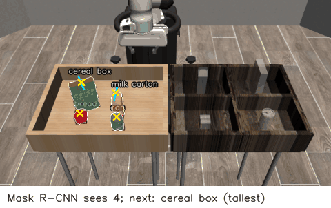
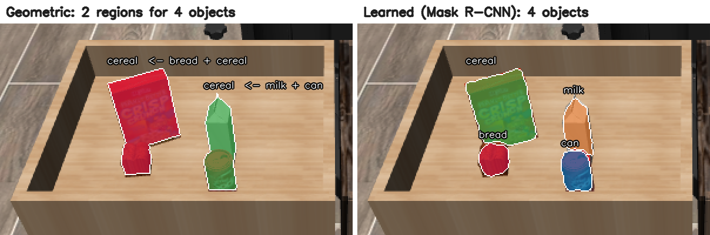

# Vision-Guided Robot Manipulation

A simulated robot arm that uses an RGB-D camera to locate an object, pick it up, and place it in a bin. The project then measures how perception errors and processing delays affect task success, and adds recovery behavior for missed grasps and stale targets.

Built on [MuJoCo](https://mujoco.org/) physics and [robosuite](https://robosuite.ai/) task assets. The setup uses a Franka Panda arm with a parallel-jaw gripper, one fixed RGB-D camera, and one rigid object per scene. Milestones 1–3 use a soda can (robosuite's `PickPlaceCan` task). Milestone 4 extends this to four object types, each with its own target compartment.


*The scene from two cameras: front view (left) and the fixed `agentview` camera used for perception (right). The arm is approaching the can in the light source bin. The can's destination is the dark target bin's compartment nearest the camera on the right, marked by a translucent gray can.*

## Status

| Milestone | State |
|---|---|
| 1. Scripted pick-and-place from known object and bin poses | **Done** |
| 2. Localize the object from RGB-D images; report position error against ground truth | **Done** |
| 3. Vision-driven pick-and-place | **Done** |
| 4. Multiple object types: estimate identity, position and orientation; orientation-aware grasp | **Done** |
| 5. Cluttered bin: sort all four objects; learned instance segmentation vs geometric | **Done** |
| 6. Timestamps, stale-target rejection, grasp check, timeouts, single retry | Next |
| 7. Held-out evaluation across ground-truth, vision, and vision + recovery configurations | Planned |

Results and a demo video will be added as each milestone is evaluated. No performance numbers are reported until they have been measured.

### Milestone 1: scripted baseline

The arm picks the can from the source bin and places it in its target compartment, using known world-frame positions instead of perception. This baseline separates motion and grasp problems from vision problems, so later failures can be attributed to perception or timing.

- The can is placed at a fixed, known pose after each reset; robosuite's default random placement is overridden.
- A phase-based policy runs `approach → descend → close → lift → transfer → lower → release → retreat`. Each phase advances when the end effector is within 1 cm of its waypoint or after a per-phase timeout.
- Motion uses robosuite's `OSC_POSE` operational-space controller with delta position inputs (1.0 action = 5 cm step) and zero rotation deltas, which keeps the gripper pointing down.
- Success is scored with robosuite's task check. The run is deterministic: every phase reaches its tolerance, and the can ends in the target compartment.
- The script also saves an RGB frame and a depth frame from the `agentview` camera as inputs for milestone 2.

### Milestone 2: object localization from RGB-D

robosuite places the can at a random position in the source bin. A single 640×480 RGB-D frame from the fixed `agentview` camera is used to estimate the can's 3D position in the world frame. The estimator ([perception.py](perception.py)) sees only the RGB image, the depth image, the camera calibration, and the known can dimensions. Only the evaluator ([scripts/localize_eval.py](scripts/localize_eval.py)) reads the true pose.

The method:

1. **Segment** the can by HSV color threshold and keep the largest connected component.
2. **Back-project** each mask pixel to a world point: convert MuJoCo's normalized depth to metric depth, apply the pinhole model at pixel centers, then transform from camera to world frame ([geometry.py](geometry.py)).
3. **Height.** The camera looks down on the can, so the lid is always visible while the base can be hidden by the bin wall. Height is the top of the point cloud minus the can's known half-height.
4. **Horizontal position.** The lid is a disk centered on the can's axis, so the axis position is the mean xy position of the lid points. Points more than one can radius from the median are dropped first.

<p>
  
  
</p>

*One held-out placement as the camera sees it (left) and zoomed 6× (right). Magenta pixels are the lid points averaged for the estimate. The red row along the can's base is where the bin's front wall hides the bottom of the can; those pixels are rejected as outliers. The estimate (yellow ×) is 1.8 mm from the true centre (blue +). Both centre markers are drawn by projecting the 3D positions back into the image.*

**Results on 100 held-out placements** (seed 1000; the method was developed on seed 0):

| Metric | Median | p95 | Max |
|---|---|---|---|
| Horizontal (xy) error | 1.4 mm | 1.9 mm | 2.1 mm |
| Vertical (z) error | 0.3 mm | 0.5 mm | 0.5 mm |
| Perception latency | 2.7 ms | 3.3 ms | 3.4 ms |

All 100 estimates were valid. Latency covers segmentation through the position estimate and excludes rendering; it was measured after warm-up on one CPU core of an AMD Ryzen 5 5600X. These are clean simulated scenes: one upright object, no clutter, the arm clear of the camera's view of the can, and no sensor noise.

**What the error is made of.** The xy error is mostly a consistent offset of about 1.3 mm in x and 0.6 mm in y, and it points toward the camera in every trial (median cosine 0.98 between the error vector and the direction to the camera). The lid is selected as the points within 4 mm of the top. From an oblique camera, that band also catches the top few millimeters of the can's near side, but never the far side, which is hidden. The offset is about 10× smaller than the gripper's lateral tolerance, so it is documented rather than corrected.

**Approaches that did not work.** These are kept here because the failures explain the final design.

- *Fitting a fixed-radius cylinder to the can's side.* From this camera, the lid makes up most of the visible can, and the side is a thin strip partly covered by a gray logo. Too few side points remained, so 18% of estimates were rejected, and some accepted ones were 20–30 mm off.
- *Pixel indices as coordinates.* Treating integer pixel indices as continuous coordinates shifts every point by half a pixel, which caused a constant 1.8 mm error. Back-projection now uses pixel centers.
- *Plain averaging of lid-height points.* In 12 of the 100 held-out placements, the source bin's front wall hides the can's base from the camera. Along that boundary, 13–21 pixels blend can and wall colors and pass the red threshold, but their depth comes from the wall's top edge, which is at the same height as the lid. These points sit 7–8 cm from the can yet pass the lid height test. Averaging them in raises the held-out xy error from 1.9 to 4.3 mm at p95 and from 2.1 to 6.4 mm at worst. Dropping points more than one can radius from the median removes them.

### Milestone 3: vision-driven pick-and-place

The camera's estimate from milestone 2 replaces the known position from milestone 1. Each trial places the can at a random pose in the source bin, takes one RGB-D frame with the arm in its start pose, estimates the can's position, and runs the scripted pick-and-place ([policy.py](policy.py)) to that target. The policy advances phases using only its own end-effector feedback. The evaluator ([scripts/pick_place_eval.py](scripts/pick_place_eval.py)) reads the can's true pose only to score and classify outcomes.

<p>
  
  
</p>

*One held-out trial, seen from the perception camera. Left: the single frame the decision is based on, with the arm in its start pose. The segmented can is green, and the inset shows the estimated centre the arm is sent to (yellow ×), 1.2 mm from the true centre (blue +). Right: the arm has closed on the can at that target and lifted it on its way to the target bin.*

A trial succeeds when robosuite's task check holds, the gripper is open, and the can moves less than 5 mm over 0.5 s of simulation, all within a 30 s simulation budget.

Each configuration runs on the same 100 held-out placements (seed 1000), and the evaluator asserts that every configuration saw identical scenes. The *truth* configuration uses the simulator's true position as the grasp target, which isolates motion and grasp failures from perception failures.

| Configuration | Success | 95% CI (Wilson) | Sim time per episode (median) |
|---|---|---|---|
| Truth target | 100 / 100 | 96.3–100% | 10.5 s |
| Vision target | 100 / 100 | 96.3–100% | 10.5 s |

Vision matches the truth reference on every placement. robosuite's own task check agreed with the stricter success rule on all 200 trials. Perception adds 2.9 ms median and 3.6 ms p95 per decision. An episode takes 1.45 s of wall time (median), about 7× faster than real time on this machine. That figure excludes rendering for review videos.

**How much error the grasp tolerates.** With no failures to analyze, a sweep replaces perception with a controlled error: the true position shifted a fixed distance in a per-trial random horizontal direction, on the same 100 placements.

| Grasp target error | Success | 95% CI | Failures |
|---|---|---|---|
| 5, 10, 15 mm | 100 / 100 each | 96–100% | none |
| 20 mm | 82 / 100 | 73–88% | 14 missed grasps, 4 dropped in transit |
| 25 mm | 27 / 100 | 19–36% | 59 missed grasps, 13 dropped, 1 misplaced |
| 30 mm | 2 / 100 | 1–7% | 91 missed grasps, 6 dropped, 1 misplaced |

The grasp tolerates at least 15 mm of error and breaks down between 15 and 25 mm. The vision estimate's worst held-out error is 2.1 mm, about 7× inside the last error that never failed.

Failure rates do not depend much on the error's direction relative to the fingers. At 20 mm, errors mostly along the finger-closing axis succeed 40/51 times, and errors mostly across it succeed 42/49 times. The two directions fail differently. In reviewed examples, an error across the closing axis leaves the fingers closing on the can's edge without a hold. An error along it brings a finger down on the lid and knocks the can over.

**Limits of this result.** The scenes are clean: one upright can, no clutter, no sensor noise, and a can that stays still between the camera frame and the grasp. The policy is open-loop after perception, so it does not check whether the grasp held. Milestone 6 adds that feedback, along with stale-target checks and a single retry.

### Milestone 4: multiple objects and orientation

A can looks the same from every angle, so milestones 1–3 never had to estimate orientation. Milestone 4 places one of four robosuite objects per scene, at a random position and a random rotation about the vertical axis. Each object goes to its own compartment of the target bin.



*Vision-guided picks of each object type from held-out placements, replayed from the evaluation at 4× speed. Each tile first shows what perception found: the object's mask, its centre (yellow ×), and the finger-closing direction (blue line) where the grasp depends on rotation.*

| Object | Footprint × height | What it adds | Grasp rotation |
|---|---|---|---|
| Can | 50 mm round × 80 mm | Baseline from milestones 1–3 | Start pose (round) |
| Milk carton | 40 × 40 mm × 144 mm | Tall and light; gable roof; nearly white on a light wooden bin | Across a pair of faces |
| Bread | 40 × 48 mm × 48 mm | Short, so the hand drops below the bin rim | Any; chosen to clear the bin walls |
| Cereal box | 30 × 100 mm × 150 mm | Fits the 80 mm gripper only across its thin side | Across the 30 mm side |



*One held-out scene per object, as the perception camera sees it. Green: the object found by depth segmentation. Magenta: its top surface, used for the pose. Yellow ×: estimated centre. Blue line: the direction the fingers will close. For the cereal box that is across its thin side; for the milk carton, along its roof ridge, i.e. across two faces. The text gives the identification and the height and footprint it was based on.*

Perception ([object_perception.py](object_perception.py)) replaces milestone 2's color threshold with geometry, so it works for any packaging. It follows the industry pattern of segment → identify → fit, with every stage geometric:

1. **Segment by depth.** Every pixel is back-projected; the object is the largest region of points inside the source bin's walls and above its floor. Bin positions are known scene layout, not object state.
2. **Identify by measured shape.** Height separates bread (48 mm), can (80 mm), and the two tall objects. The footprint separates those: about 100 mm long for cereal vs 40 mm for milk. A measured height that does not match the identified object makes the estimate invalid.
3. **Fit the pose from the top surface.** Centre = centroid of the top-surface points after median-based outlier rejection. The cereal box's rotation comes from a minimum-area rectangle fit to its top face. The milk carton's comes from the principal direction of its roof ridge, which runs parallel to two faces.

The grasp ([policy.py](policy.py)) turns the gripper about the vertical axis to the object's closing direction, grasps 2.5 cm below the object's top, and sets carry and release heights from the object's size.

**Results on held-out placements** (50 per object, seeds 3000–3003; development used seeds 0–3 and 2000–2003). Both configurations run on identical placements, checked by the evaluator.

| Object | Truth target | Vision target | Identified correctly |
|---|---|---|---|
| Milk carton | 50 / 50 | 50 / 50 | 50 / 50 |
| Bread | 50 / 50 | 50 / 50 | 50 / 50 |
| Cereal box | 50 / 50 | 50 / 50 | 50 / 50 |
| Can | 50 / 50 | 50 / 50 | 50 / 50 |
| **All** | **200 / 200** (95% CI 98.1–100%) | **200 / 200** (98.1–100%) | **200 / 200** |

| Vision error (all objects) | Median | p95 | Max |
|---|---|---|---|
| Horizontal centre | 1.7 mm | 3.1 mm | 3.5 mm |
| Top height | 0.5 mm | 0.8 mm | 2.6 mm |
| Cereal box rotation | 0.01° | 0.02° | 0.11° |
| Milk carton rotation (modulo 90°) | 0.2° | 0.7° | 1.3° |
| Perception latency | 12.7 ms | 21 ms | 42 ms |

Episodes take 9.7 s of simulated time (median), and no phase timed out. Latency is higher than milestone 2's 2.7 ms because every pixel of the 640×480 frame is back-projected before segmentation. That is still well within the 100 ms target; cropping to the bin's image region would reduce it.
**How much rotation error the cereal-box grasp tolerates.** The true target with the finger direction rotated by a fixed angle, on the same 50 placements:

| Rotation error | 10° | 20° | 30° | 45° | 60° | 75° | No alignment (start pose) |
|---|---|---|---|---|---|---|---|
| Success | 50 / 50 | 50 / 50 | 50 / 50 | 50 / 50 | 0 / 50 | 0 / 50 | 33 / 50 |

The grasp tolerates at least 45° and fails completely by 60°, all as missed grasps. Contact-level checks show the box does not twist into alignment as the fingers close: at 45° it is lifted still 45° off. The finger pads are narrow, so what matters is the box's width along the strip each finger sweeps on the way down, not its full outline. Up to 45°, the box's corners pass beside the pads. At 60°, a corner lies under a descending finger, which lands on the box and knocks it over. Vision's worst cereal-box rotation error, 0.11°, is about 400× inside the tolerated range. Without any rotation estimate, the grasp succeeds only when the random rotation happens to fall in that range (33/50), so estimating rotation is necessary.

**Problems found while building this.** Each was diagnosed from contact or joint data before being fixed.

- *The hand hit the bin walls when grasping bread.* The Panda hand is 20.4 cm long along the finger-closing axis. Bread is short enough that the hand drops below the bin rim and its ends hit a wall within about 10 cm, which caused stalled descents and one dropped loaf in development. The grasp planner now tries every rotation the object allows and keeps the one with the most wall clearance.
- *The wrist joint hit its limit for some cereal-box rotations.* A parallel gripper grasps identically at yaws 180° apart. Choosing within ±90° sent wrist joint 7 to its +166° limit when the needed yaw was near −80°, stalling the transfer in 6 of 50 placements. Choosing the equivalent yaw in [−45°, 135°) keeps the joint well clear.
- *A strictly vertical gripper could not reach the can's compartment*, the farthest corner of the target bin. Round objects keep milestone 3's start orientation, whose slight tilt gives the arm the extra reach.

**Limits.** One object per scene, always upright, no clutter, no sensor noise. Identification relies on four objects with distinct shapes. A larger catalog, or objects with similar shapes, would need appearance-based recognition such as a learned classifier, which is the natural next comparison. The policy is still open-loop after perception; milestone 6 adds grasp checks and retry.

### Milestone 5: sorting a cluttered bin with learned segmentation

All four objects now start together in the source bin, at random positions and rotations, often touching. The robot sorts them one at a time into their compartments, re-observing the scene before every pick. Milestone 4's depth segmentation assumes one object per connected region, which breaks when objects touch. Milestone 5 measures how badly, then replaces the segmentation and identification stages with a trained instance-segmentation network. Back-projection and pose fitting stay the same, following the common industry pattern of a learned 2D detector feeding geometric 3D fitting.



*Held-out scene 0, the scene in the figure below where geometric segmentation sorted only 2 of 4 objects, replayed at 5× speed. Before each pick the robot re-observes; the GIF shows the Mask R-CNN masks and labels, then the arm takes the tallest remaining object.*



*First view of held-out scene 0. Left: geometric segmentation finds 2 regions for 4 objects. Bread merges with the cereal box, and the milk carton merges with the can. The merged carton and can measure 144 mm tall and about 100 mm long, so they are confidently mislabeled as a cereal box instead of being rejected. Right: Mask R-CNN separates and labels all four.*

**Learned segmentation** ([segmenter.py](segmenter.py)). The model is torchvision's Mask R-CNN, pretrained on COCO, with new box and mask heads for the four classes. It sees only the RGB image. Detections mostly outside the source bin are discarded first, because the network also sees objects already placed in the target bin. Its masks select each object's depth points, intersected with the above-floor region, and its class replaces shape-based identification. The 3D fit is milestone 4's. A measured height that contradicts the predicted class still rejects the estimate.

- **Training data** ([scripts/make_seg_dataset.py](scripts/make_seg_dataset.py)): 3,000 training and 300 validation images, rendered automatically. Each shows a random subset of the objects at random poses, under randomized lighting. Labels come from the simulator's segmentation render and cover only visible pixels. They are used for training and evaluation only, never as inputs to the robot. Training, validation, development and evaluation scenes use disjoint seeds.
- **Training** ([scripts/train_segmenter.py](scripts/train_segmenter.py)): 10 epochs, about 4 minutes each on an RTX 4070 SUPER. Validation reached 905 of 926 objects detected with the correct class at IoU ≥ 0.5, with median mask IoU 0.93, and plateaued after the first epoch. The misses are almost all slivers: 15 of the 20 are bread loaves showing only 30–44 pixels behind taller objects. Objects with at least 100 visible pixels are detected and correctly classified 906 of 910 times.

**Sorting policy** ([scripts/clutter_eval.py](scripts/clutter_eval.py)). The robot picks the tallest remaining object first, so the hand passes above everything still in the bin, and gives each object one attempt (retry is milestone 6). The truth configuration uses simulator poses as targets to isolate motion and grasp failures. An object counts as sorted if it rests in its own compartment and stays still for 0.5 s.

**Results on 50 held-out cluttered scenes** (200 objects; seeds 5000+; development used seed 100):

| Configuration | Objects sorted | Scenes fully sorted |
|---|---|---|
| Truth targets (reference) | 199 / 200 (95% CI 97.2–99.9%) | 49 / 50 |
| Geometric segmentation | 169 / 200 (84.5%; CI 78.8–88.9%) | 36 / 50 |
| **Learned segmentation** | **199 / 200** (CI 97.2–99.9%) | **49 / 50** |

| Segmentation on each scene's first view (200 objects) | Geometric | Learned |
|---|---|---|
| Object merged with a neighbor into one region | 95 | 3 |
| Detected (mask IoU ≥ 0.5) with correct label | 132 | 197 |
| Median mask IoU | 0.85 | 0.93 |
| Picks of an object under the wrong label | 4 | 0 |
| Perception time per observation (mean, in the loop) | 14 ms | 208 ms |

- **Learned segmentation matches the truth reference.** Its one failure is the same object as the reference's: a cereal box that started leaning 37° against the bin wall, which a top-down grasp cannot handle. The reference attempted it and failed. The learned pipeline measured the box at 114 mm instead of 150 mm, rejected the estimate, and sorted the other three.
- **Geometric segmentation fails by running out of trustworthy targets.** All 14 of its failed scenes ended before every object was attempted: the remaining merged regions failed the height check or carried a label already attempted. Merges did not always cause failure. Fitting the top surface still finds the tallest object inside a merged region, and each pick shrinks the clutter for the next observation. The milk carton (13 left behind) and the can (11) suffered most, because they often merge with each other.
- **Latency is the cost.** Back-to-back, the network takes 54 ms on the GPU. Inside the loop it averages about 190 ms, because the GPU drops to a low-power state during the roughly 10 s of simulation between observations: after a 10 s idle period, the median inference is 120 ms, with spikes to 282 ms. The total is above the 100 ms target. Keeping the GPU busy, exporting to TensorRT, or a lighter model would address it; the 54 ms figure shows the model itself fits.

**Problems found while building this**, each traced from contact, joint, or position data before being fixed:

- *Round objects inherited the previous pick's orientation.* "Keep the current orientation" meant the start pose in milestone 4 but the milk carton's vertical pose in clutter, which cannot reach the can's compartment. The start orientation is now passed explicitly. It is held while grasping and released after the lift, so the arm can tilt to reach.
- *The can's compartment is at the edge of the arm's reach*, 0.86 m from the robot base against the Panda's 0.855 m. Moves to and from it pinned the elbow at its joint limit, and stalled the next pick. Objects are now released at the point of their compartment closest to the robot, which is anywhere that scores, with a margin that covers the closed fingers. The arm also returns to its start pose after every pick, which keeps the camera's view clear.
- *A carried cereal box knocked over the milk carton.* The carry height cleared the bin rim but not the 144 mm carton; the box hangs 12.5 cm below the gripper. The carry height now clears the tallest remaining object, using perceived heights in the vision configurations.
- *Bread's release lowered the hand below the target bin's rim*, where it hit the compartment walls. The release height now keeps the hand above the rim. This also changes milestone 4's bread releases; its evaluation was rerun with unchanged success.

**Limits.** Each object type appears at most once per scene, and inference keeps the best detection per class. Objects are known in advance; the network has not seen new packaging. Simulated images are clean, so lighting is the only randomized appearance factor. Objects that start leaning or lying down are not graspable by this top-down policy.

## System design

The target architecture keeps perception, geometry, and task logic as separate components with small interfaces. In the final vision configuration, the policy cannot access simulator object poses or segmentation IDs; only the evaluator uses ground truth.

| Component | Input | Output |
|---|---|---|
| Simulator adapter | Scene, robot actions | RGB, depth, timestamps, robot state |
| Perception | RGB and depth | Object mask, grasp point, validity flag |
| Geometry | Pixel, metric depth, camera calibration | Grasp position in the robot base frame |
| Task logic | Grasp target, robot feedback | Phase, motion target, gripper command |
| Controller adapter | Target and current end-effector pose | robosuite action vector |
| Evaluator | Simulator ground truth, episode log | Success, position error, latency, failure category |

## Quick start

Requires Linux (WSL2 works) and Python 3.10. Milestone 5's learned segmentation also needs an NVIDIA GPU with a CUDA 12 driver; the lock file pins PyTorch's CUDA 12.4 build.

```bash
python3.10 -m venv .venv
source .venv/bin/activate
pip install -r requirements-lock.txt --extra-index-url https://download.pytorch.org/whl/cu124
python scripts/pick_place_scripted.py          # writes results/step1/
```

The script exits with status 0 on task success. Outputs:

- `results/step1/pick_place.mp4`: front and agentview cameras side by side
- `results/step1/key_*.png`: final frame of each phase
- `results/step1/agentview_rgb.png`, `agentview_depth_normalized.npy`: one RGB-D frame

Localization evaluation:

```bash
python scripts/localize_eval.py --trials 100 --seed 1000   # writes results/step2/
```

Outputs: `trials.csv` (per-trial estimate, truth, error and latency), `summary.json`, and zoomed overlays of the best, median and worst trials in `overlays/`. In the overlays, the mask is green, the true position is a blue cross, and the estimate is a yellow ×.

Pick-and-place evaluation and grasp-error sweep:

```bash
python scripts/pick_place_eval.py --trials 100 --seed 1000                      # truth vs vision
python scripts/pick_place_eval.py --trials 100 --seed 1000 \
    --configs offset5 offset10 offset15 offset20 offset25 offset30 --out results/step3_sweep
```

Outputs: `trials.csv` (per-trial outcome, failure category, target error, timings) and `summary.json` (success rates with confidence intervals, outcome counts, latency and episode-time statistics). For the vision configuration only, `cases/` holds a video and perception overlay for 3 successful trials, chosen to show the can at well-separated positions in the bin, plus up to 3 failures if any occur. Trials run without rendering. Saved cases are then replayed with video from a fresh environment, and the script asserts that each replay reproduces the original outcome and final can position.

Multi-object evaluation and rotation sweep:

```bash
python scripts/multi_object_eval.py --trials 50 --seed 3000                      # truth vs vision, 4 objects
python scripts/multi_object_eval.py --trials 50 --seed 3000 --objects cereal --no-videos \
    --configs yaw10 yaw20 yaw30 yaw45 yaw60 yaw75 noalign --out results/step4_yaw_sweep
```

Outputs as above, plus per-object identification accuracy and rotation error in `summary.json`. `cases/` holds one vision success video per object, plus vision failures if any occur.

Cluttered-bin evaluation (the learned configuration needs the GPU setup above):

```bash
python scripts/make_seg_dataset.py --train 3000 --val 300        # writes data/seg/ (~30 min)
python scripts/train_segmenter.py --epochs 10                    # writes models/maskrcnn_seg.pt (~40 min on an RTX 4070 SUPER)
python scripts/clutter_eval.py --scenes 50 --seed 5000           # truth, geometric, learned; writes results/step5/
```

Outputs: `trials.csv` (per-scene outcome for each object, pick order, segmentation scores on the first view, perception error and latency) and `summary.json` (objects and scenes sorted with confidence intervals, per-object outcomes, segmentation statistics). `cases/` holds demo videos of learned-configuration scenes: two fully sorted, plus up to three that were not.

## Engineering notes

- **MuJoCo version pin.** robosuite 1.5.2 fails on startup with MuJoCo 3.14 because newer MuJoCo returns joint types that no longer compare equal to robosuite's enum check. `requirements-lock.txt` pins MuJoCo 3.3.7.
- **Rendering backend.** robosuite forces `MUJOCO_GL=egl` unless the variable is `glx` or `osmesa`. On WSL without access to `/dev/dri/renderD128`, EGL falls back to a software path that can return corrupted frames. When a display is available, the script sets `MUJOCO_GL=glx`, which makes robosuite render through its GLFW context.
- **Image orientation.** robosuite camera images use OpenGL's bottom-left origin. RGB and depth are both flipped vertically before saving so that pixel coordinates match standard image convention for later back-projection.
- **Depth units.** robosuite returns MuJoCo's normalized `[0, 1]` depth buffer, not metres. `geometry.py` converts it to optical-axis depth using the near and far clip planes.
- **Camera frame.** MuJoCo cameras look down their −z axis with y up. `geometry.py` flips y and z to get OpenCV axes, which match the vertically flipped images. Each evaluation run checks that projection followed by back-projection recovers 100 random points to within 1e-9 m.
- **Renderer resets.** robosuite's default `hard_reset=True` rebuilds the renderer on every reset, which crashed with heap corruption on the WSL GLFW path. The evaluation uses `hard_reset=False`.
- **Grasp height.** The finger pads span 5.5 mm below to 12.8 mm above the controller's grip site, and the hand's underside is 28.5 mm above it. A grip site deeper than about 2.5 cm below an object's top lands the palm on the object. With the can, a target at its center stalled 21 mm short, with contact between the hand and the can's top. The grasp point is therefore 2.5 cm below the object's top (1.5 cm above the can's center). An earlier version of this note blamed the fingers hitting the bin floor; contact logging showed the palm was the cause.
- **Hand clearance in the bin.** The Panda hand is 20.4 cm long along the finger-closing axis. Grasping a short object (the 48 mm bread) puts the hand below the bin rim, where its ends hit the walls when the object is within about 10 cm of one. The grasp planner tries every rotation the object allows and picks the one that keeps the hand farthest from the walls.

## Repository layout

```
geometry.py                      Camera model: depth conversion, projection, back-projection
perception.py                    Can localization from one RGB-D frame (no simulator state)
object_perception.py             Multi-object identification and pose from depth (no simulator state)
segmenter.py                     Mask R-CNN instance segmentation (RGB only), used by milestone 5
policy.py                        Scripted pick-and-place phases, grasp rotation and wall clearance
scripts/pick_place_scripted.py   Milestone 1: scripted pick-and-place with known poses
scripts/localize_eval.py         Milestone 2: localization error against ground truth
scripts/pick_place_eval.py       Milestone 3: truth vs vision pick-and-place, grasp-error sweep
scripts/multi_object_eval.py     Milestone 4: four objects, truth vs vision, rotation-error sweep
scripts/clutter_eval.py          Milestone 5: cluttered bin, truth vs geometric vs learned
scripts/make_seg_dataset.py      Milestone 5: render labeled segmentation dataset
scripts/train_segmenter.py       Milestone 5: fine-tune Mask R-CNN
scripts/make_demo_gifs.py        README demo GIFs, replayed from evaluated trials
docs/images/                     Figures used in this README
requirements-lock.txt            Exact package versions
results/, data/, models/        Generated outputs, dataset and trained weights (not committed)
```

## Evaluation plan

The final evaluation runs the same held-out scene seeds under three configurations: ground-truth motion, vision baseline, and vision with recovery. Tuning uses a separate development seed set. A trial succeeds when the object is inside the target bin, the gripper has released it, and the object is stable for 0.5 s of simulation time, all within a 30 s simulation timeout. Reported metrics:

- Task success rate, with confidence intervals
- Median and p95 position error between the estimated and true object position
- p95 perception latency
- Target age at decision time
- Completion time in both simulation and wall-clock time
- Failure counts by category: missed grasp, wrong target, stale frame, timeout, prohibited contact
