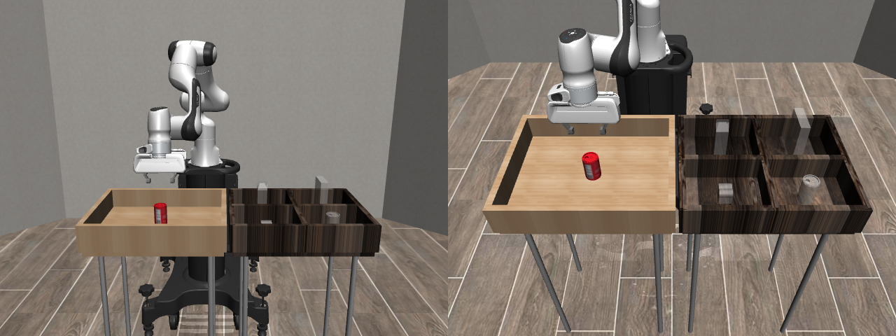
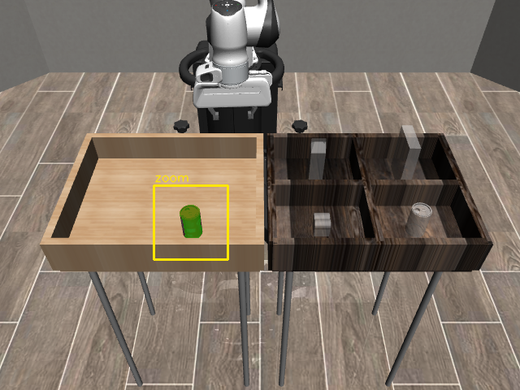
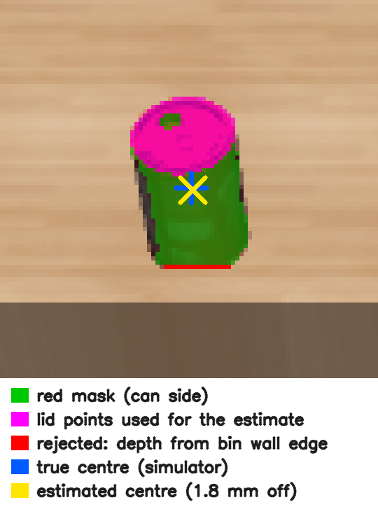

# Vision-Guided Robot Manipulation

A simulated robot arm that uses an RGB-D camera to locate an object, pick it up, and place it in a bin. The project then measures how perception errors and processing delays affect task success, and adds recovery behavior for missed grasps and stale targets.

Built on [MuJoCo](https://mujoco.org/) physics and [robosuite](https://robosuite.ai/) task assets. The setup uses a Franka Panda arm with a parallel-jaw gripper, one fixed RGB-D camera, and one rigid object (robosuite's `PickPlaceCan` task).



*The scene from two cameras: front view (left) and the fixed `agentview` camera used for perception (right). The arm is approaching the can in the light source bin. The can's destination is the dark target bin's compartment nearest the camera on the right, marked by a translucent gray can.*

## Status

| Milestone | State |
|---|---|
| 1. Scripted pick-and-place from known object and bin poses | **Done** |
| 2. Localize the object from RGB-D images; report position error against ground truth | **Done** |
| 3. Vision-driven pick-and-place | Next |
| 4. Timestamps, stale-target rejection, timeouts, single retry | Planned |
| 5. Held-out evaluation across ground-truth, vision, and vision + recovery configurations | Planned |

Results and a demo video will be added as each milestone is evaluated. No performance numbers are reported until they have been measured.

### Milestone 1: scripted baseline

The arm picks the can from the source bin and places it in its target compartment, using known world-frame positions instead of perception. This baseline separates motion and grasp problems from vision problems, so later failures can be attributed to perception or timing.

- The can is placed at a fixed, known pose after each reset; robosuite's default random placement is overridden.
- A phase-based policy runs `approach → descend → close → lift → transfer → lower → release → retreat`. Each phase advances when the end effector is within 1 cm of its waypoint or after a per-phase timeout.
- Motion uses robosuite's `OSC_POSE` operational-space controller with delta position inputs (1.0 action = 5 cm step) and zero rotation deltas, which keeps the gripper pointing down.
- Success is scored with robosuite's task check. The run is deterministic: every phase reaches its tolerance, and the can ends in the target compartment.
- The script also saves an RGB frame and a depth frame from the `agentview` camera as inputs for milestone 2.

### Milestone 2: object localization from RGB-D

robosuite places the can at a random position in the source bin. A single 640×480 RGB-D frame from the fixed `agentview` camera is used to estimate the can's 3D position in the world frame. The estimator ([perception.py](perception.py)) sees only the RGB image, the depth image, the camera calibration, and the known can dimensions. Only the evaluator ([scripts/localize_eval.py](scripts/localize_eval.py)) reads the true pose.

The method:

1. **Segment** the can by HSV color threshold and keep the largest connected component.
2. **Back-project** each mask pixel to a world point: convert MuJoCo's normalized depth to metric depth, apply the pinhole model at pixel centers, then transform from camera to world frame ([geometry.py](geometry.py)).
3. **Height.** The camera looks down on the can, so the lid is always visible while the base can be hidden by the bin wall. Height is the top of the point cloud minus the can's known half-height.
4. **Horizontal position.** The lid is a disk centered on the can's axis, so the axis position is the mean xy position of the lid points. Points more than one can radius from the median are dropped first.

<p>
  
  
</p>

*One held-out placement as the camera sees it (left) and zoomed 6× (right). Magenta pixels are the lid points averaged for the estimate. The red row along the can's base is where the bin's front wall hides the bottom of the can; those pixels are rejected as outliers. The estimate (yellow ×) is 1.8 mm from the true centre (blue +). Both centre markers are drawn by projecting the 3D positions back into the image.*

**Results on 100 held-out placements** (seed 1000; the method was developed on seed 0):

| Metric | Median | p95 | Max |
|---|---|---|---|
| Horizontal (xy) error | 1.4 mm | 1.9 mm | 2.1 mm |
| Vertical (z) error | 0.3 mm | 0.5 mm | 0.5 mm |
| Perception latency | 2.7 ms | 3.3 ms | 3.4 ms |

All 100 estimates were valid. Latency covers segmentation through the position estimate and excludes rendering; it was measured after warm-up on one CPU core of an AMD Ryzen 5 5600X. These are clean simulated scenes: one upright object, no clutter, the arm clear of the camera's view of the can, and no sensor noise.

**What the error is made of.** The xy error is mostly a consistent offset of about 1.3 mm in x and 0.6 mm in y, and it points toward the camera in every trial (median cosine 0.98 between the error vector and the direction to the camera). The lid is selected as the points within 4 mm of the top. From an oblique camera, that band also catches the top few millimeters of the can's near side, but never the far side, which is hidden. The offset is about 10× smaller than the gripper's lateral tolerance, so it is documented rather than corrected.

**Approaches that did not work.** These are kept here because the failures explain the final design.

- *Fitting a fixed-radius cylinder to the can's side.* From this camera, the lid makes up most of the visible can, and the side is a thin strip partly covered by a gray logo. Too few side points remained, so 18% of estimates were rejected, and some accepted ones were 20–30 mm off.
- *Pixel indices as coordinates.* Treating integer pixel indices as continuous coordinates shifts every point by half a pixel, which caused a constant 1.8 mm error. Back-projection now uses pixel centers.
- *Plain averaging of lid-height points.* In 12 of the 100 held-out placements, the source bin's front wall hides the can's base from the camera. Along that boundary, 13–21 pixels blend can and wall colors and pass the red threshold, but their depth comes from the wall's top edge, which is at the same height as the lid. These points sit 7–8 cm from the can yet pass the lid height test. Averaging them in raises the held-out xy error from 1.9 to 4.3 mm at p95 and from 2.1 to 6.4 mm at worst. Dropping points more than one can radius from the median removes them.

## System design

The target architecture keeps perception, geometry, and task logic as separate components with small interfaces. In the final vision configuration, the policy cannot access simulator object poses or segmentation IDs; only the evaluator uses ground truth.

| Component | Input | Output |
|---|---|---|
| Simulator adapter | Scene, robot actions | RGB, depth, timestamps, robot state |
| Perception | RGB and depth | Object mask, grasp point, validity flag |
| Geometry | Pixel, metric depth, camera calibration | Grasp position in the robot base frame |
| Task logic | Grasp target, robot feedback | Phase, motion target, gripper command |
| Controller adapter | Target and current end-effector pose | robosuite action vector |
| Evaluator | Simulator ground truth, episode log | Success, position error, latency, failure category |

## Quick start

Requires Linux (WSL2 works) and Python 3.10.

```bash
python3.10 -m venv .venv
source .venv/bin/activate
pip install -r requirements-lock.txt
python scripts/pick_place_scripted.py          # writes results/step1/
```

The script exits with status 0 on task success. Outputs:

- `results/step1/pick_place.mp4`: front and agentview cameras side by side
- `results/step1/key_*.png`: final frame of each phase
- `results/step1/agentview_rgb.png`, `agentview_depth_normalized.npy`: one RGB-D frame

Localization evaluation:

```bash
python scripts/localize_eval.py --trials 100 --seed 1000   # writes results/step2/
```

Outputs: `trials.csv` (per-trial estimate, truth, error and latency), `summary.json`, and zoomed overlays of the best, median and worst trials in `overlays/`. In the overlays, the mask is green, the true position is a blue cross, and the estimate is a yellow ×.

## Engineering notes

- **MuJoCo version pin.** robosuite 1.5.2 fails on startup with MuJoCo 3.14 because newer MuJoCo returns joint types that no longer compare equal to robosuite's enum check. `requirements-lock.txt` pins MuJoCo 3.3.7.
- **Rendering backend.** robosuite forces `MUJOCO_GL=egl` unless the variable is `glx` or `osmesa`. On WSL without access to `/dev/dri/renderD128`, EGL falls back to a software path that can return corrupted frames. When a display is available, the script sets `MUJOCO_GL=glx`, which makes robosuite render through its GLFW context.
- **Image orientation.** robosuite camera images use OpenGL's bottom-left origin. RGB and depth are both flipped vertically before saving so that pixel coordinates match standard image convention for later back-projection.
- **Depth units.** robosuite returns MuJoCo's normalized `[0, 1]` depth buffer, not metres. `geometry.py` converts it to optical-axis depth using the near and far clip planes.
- **Camera frame.** MuJoCo cameras look down their −z axis with y up. `geometry.py` flips y and z to get OpenCV axes, which match the vertically flipped images. Each evaluation run checks that projection followed by back-projection recovers 100 random points to within 1e-9 m.
- **Renderer resets.** robosuite's default `hard_reset=True` rebuilds the renderer on every reset, which crashed with heap corruption on the WSL GLFW path. The evaluation uses `hard_reset=False`.
- **Grasp height.** The fingertips extend about 2 cm below the controller's grip site. A grasp target at the can's center drove the fingers into the bin floor, so the grasp point is set slightly above center.

## Repository layout

```
geometry.py                      Camera model: depth conversion, projection, back-projection
perception.py                    Can localization from one RGB-D frame (no simulator state)
scripts/pick_place_scripted.py   Milestone 1: scripted pick-and-place with known poses
scripts/localize_eval.py         Milestone 2: localization error against ground truth
requirements-lock.txt            Exact package versions
results/                         Generated outputs (not committed)
```

`sim_adapter.py`, `policy.py`, and `evaluate.py` will be split out when perception and motion are connected.

## Evaluation plan

The final evaluation runs the same held-out scene seeds under three configurations: ground-truth motion, vision baseline, and vision with recovery. Tuning uses a separate development seed set. A trial succeeds when the object is inside the target bin, the gripper has released it, and the object is stable for 0.5 s of simulation time, all within a 30 s simulation timeout. Reported metrics:

- Task success rate, with confidence intervals
- Median and p95 position error between the estimated and true object position
- p95 perception latency
- Target age at decision time
- Completion time in both simulation and wall-clock time
- Failure counts by category: missed grasp, wrong target, stale frame, timeout, prohibited contact
